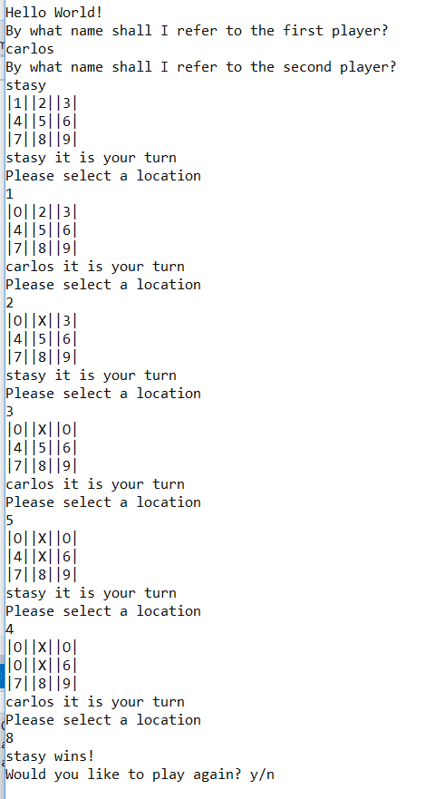

# Lab04 - TicTacToe
A console application that allows the user to play the timeless classic Tic-Tac-Toe

## Getting Started
- Open Project with Visual Studio. 
- Debug > Start Without Debugging

* OR
- from the command line
- git clone git@github.com:carloscadena/Lab04_TicTacToe.git
- cd Lab04-TicTacToe/Lab04-TicTacToe/Lab04-TicTacToe
- dotnet run

 ## Visual

 
